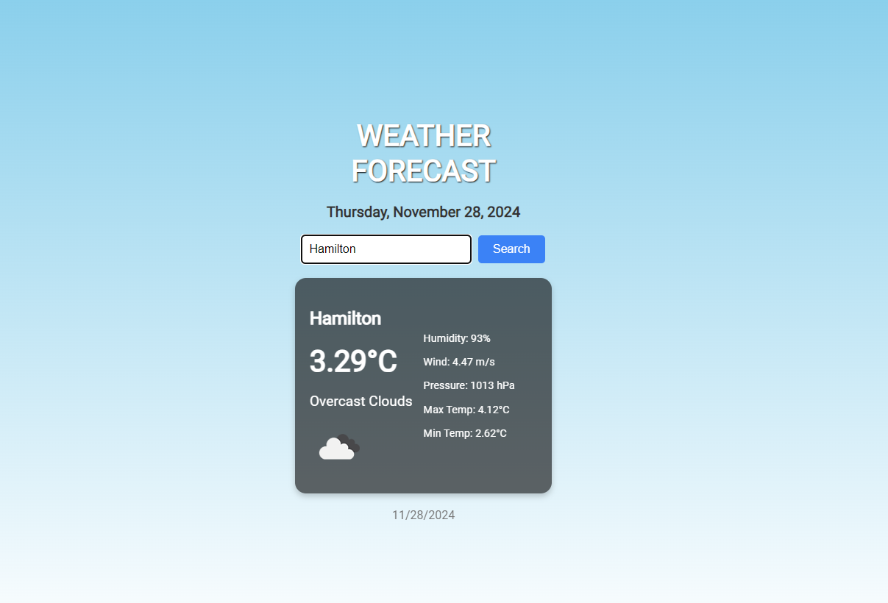

# Weather App

A simple React-based weather application that allows users to check real-time weather data for any city using the OpenWeatherMap API.

## Project Overview

This project uses **React** to fetch and display weather data. It shows the current temperature, humidity, wind speed, and weather description for any given city.

## Features

- **Weather Data**: Displays current weather, temperature, humidity, wind speed, and description.
- **City Search**: Allows users to search for weather data by entering a city name.
- **API Integration**: Fetches data from the OpenWeatherMap API.

## Screenshots

Here’s an example of the app’s interface:

- **Description**: This is the main screen where users can input the city name and view the current weather data.

